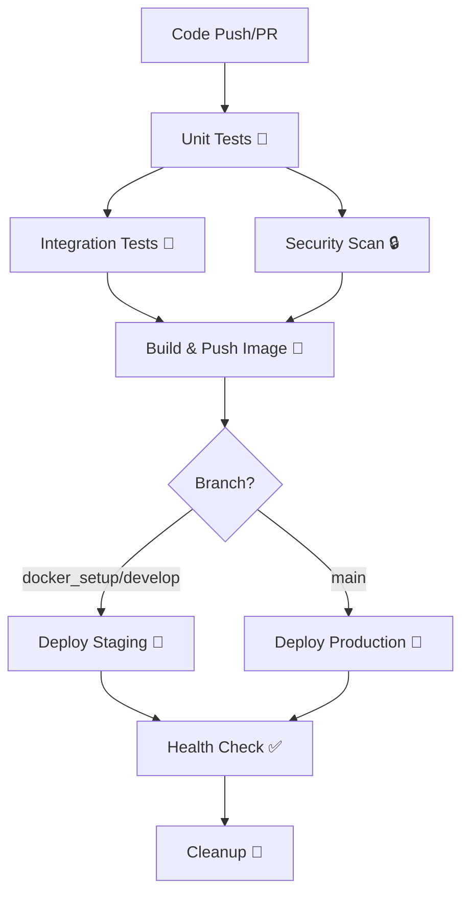

# Bridge Service - CI/CD Pipeline Documentation

This document describes the comprehensive CI/CD pipeline for the Bridge Service, including testing, security scanning, and deployment to Google Cloud Platform.

## 🚀 Pipeline Overview

The CI/CD pipeline consists of multiple stages that ensure code quality, security, and reliable deployments:



## 📋 Pipeline Stages

### 1. 🧪 Unit Tests
- **Trigger**: All pushes and pull requests
- **Purpose**: Verify individual component functionality
- **Tools**: Maven Surefire, JaCoCo for coverage
- **Artifacts**: Test reports, coverage reports

```yaml
- name: Run unit tests
  run: ./mvnw clean test -Dspring.profiles.active=test
```

### 2. 🔧 Integration Tests
- **Trigger**: After successful unit tests
- **Purpose**: Test service interactions with mock dependencies
- **Environment**: Docker containers with mock services
- **Tools**: Maven Failsafe, Docker Compose

```yaml
- name: Start test environment
  run: docker compose -f docker-compose.yml up -d
```

### 3. 🔒 Security Scan
- **Trigger**: Parallel with integration tests
- **Purpose**: Identify security vulnerabilities in dependencies
- **Tools**: OWASP Dependency Check
- **Configuration**: `.github/owasp-suppression.xml`

### 4. 🐳 Build & Push Container Image
- **Trigger**: After successful tests (non-PR branches)
- **Purpose**: Create and push Docker images to Google Container Registry
- **Features**:
  - Multi-stage builds for optimization
  - Build cache for faster builds
  - Multiple tags (SHA, branch, latest)

### 5. 🚀 Deployment
- **Staging**: `docker_setup` and `develop` branches
- **Production**: `main` branch or manual trigger
- **Platform**: Google Cloud Run
- **Features**:
  - Environment-specific configurations
  - Health checks post-deployment
  - Rollback capabilities

### 6. 🧹 Cleanup
- **Purpose**: Remove old container images
- **Strategy**: Keep last 10 images, delete older ones

## 🔧 Configuration

### Environment Variables

The pipeline uses the following environment variables:

| Variable | Description | Required |
|----------|-------------|----------|
| `JAVA_VERSION` | Java version for builds | ✅ |
| `PROJECT_ID` | Google Cloud Project ID | ✅ |
| `REGISTRY` | Container registry URL | ✅ |
| `SERVICE_NAME` | Cloud Run service name | ✅ |
| `REGION` | GCP deployment region | ✅ |

### GitHub Secrets

Configure these secrets in your GitHub repository:

#### Required Secrets
| Secret | Description |
|--------|-------------|
| `GCP_SERVICE_ACCOUNT_KEY` | GCP service account JSON key |
| `GCP_PROJECT_ID` | Google Cloud Project ID |
| `CLOUD_RUN_SERVICE_ACCOUNT` | Service account for Cloud Run |

#### Environment-Specific Secrets
| Secret | Environment | Description |
|--------|-------------|-------------|
| `STAGING_APP_A_URL` | Staging | Application A URL |
| `STAGING_APP_B_URL` | Staging | Application B URL |
| `PROD_APP_A_URL` | Production | Application A URL |
| `PROD_APP_B_URL` | Production | Application B URL |

#### Secret Manager Secrets
| Secret Name | Description |
|-------------|-------------|
| `staging-app-a-key` | Staging Application A API key |
| `staging-app-b-key` | Staging Application B API key |
| `prod-app-a-key` | Production Application A API key |
| `prod-app-b-key` | Production Application B API key |

#### Optional Secrets
| Secret | Description |
|--------|-------------|
| `SLACK_WEBHOOK` | Slack webhook for notifications |

## 🔑 Google Cloud Setup

### 1. Enable Required APIs

```bash
gcloud services enable \
  cloudbuild.googleapis.com \
  run.googleapis.com \
  containerregistry.googleapis.com \
  secretmanager.googleapis.com
```

### 2. Create Service Account

```bash
# Create service account
gcloud iam service-accounts create github-actions \
  --display-name="GitHub Actions"

# Grant necessary permissions
gcloud projects add-iam-policy-binding $PROJECT_ID \
  --member="serviceAccount:github-actions@$PROJECT_ID.iam.gserviceaccount.com" \
  --role="roles/run.admin"

gcloud projects add-iam-policy-binding $PROJECT_ID \
  --member="serviceAccount:github-actions@$PROJECT_ID.iam.gserviceaccount.com" \
  --role="roles/storage.admin"

gcloud projects add-iam-policy-binding $PROJECT_ID \
  --member="serviceAccount:github-actions@$PROJECT_ID.iam.gserviceaccount.com" \
  --role="roles/secretmanager.secretAccessor"

# Generate and download key
gcloud iam service-accounts keys create github-actions-key.json \
  --iam-account=github-actions@$PROJECT_ID.iam.gserviceaccount.com
```

### 3. Create Secrets in Secret Manager

```bash
# Staging secrets
echo -n "staging-app-a-api-key" | gcloud secrets create staging-app-a-key --data-file=-
echo -n "staging-app-b-api-key" | gcloud secrets create staging-app-b-key --data-file=-

# Production secrets
echo -n "prod-app-a-api-key" | gcloud secrets create prod-app-a-key --data-file=-
echo -n "prod-app-b-api-key" | gcloud secrets create prod-app-b-key --data-file=-
```

### 4. Create Cloud Run Service Account

```bash
# Create service account for Cloud Run
gcloud iam service-accounts create bridge-service-runner \
  --display-name="Bridge Service Runner"

# Grant Secret Manager access
gcloud projects add-iam-policy-binding $PROJECT_ID \
  --member="serviceAccount:bridge-service-runner@$PROJECT_ID.iam.gserviceaccount.com" \
  --role="roles/secretmanager.secretAccessor"
```

## 🎯 Triggering the Pipeline

### Automatic Triggers

| Branch | Trigger | Actions |
|--------|---------|---------|
| `main` | Push | Unit Tests → Integration Tests → Security Scan → Build → Deploy Production |
| `docker_setup` | Push | Unit Tests → Integration Tests → Security Scan → Build → Deploy Staging |
| `develop` | Push | Unit Tests → Integration Tests → Security Scan → Build → Deploy Staging |
| Any branch | Pull Request to `main` | Unit Tests → Integration Tests → Security Scan |

### Manual Triggers

Use GitHub Actions UI to manually trigger deployments:

1. Go to **Actions** tab in your repository
2. Select **Bridge Service CI/CD** workflow
3. Click **Run workflow**
4. Choose environment (staging/production)
5. Click **Run workflow**

## 📊 Monitoring and Reporting

### Test Reports
- **Unit Test Results**: Available in Actions summary
- **Integration Test Results**: Available in Actions summary
- **Coverage Reports**: Uploaded to Codecov (if configured)

### Security Reports
- **OWASP Dependency Check**: Downloadable artifacts
- **Container Image Scanning**: GCP Vulnerability Analysis

### Deployment Notifications
- **Slack Integration**: Deployment status notifications
- **GitHub Environments**: Deployment history and approvals

## 🔄 Pipeline Workflows

### Pull Request Workflow
```bash
git checkout -b feature/new-feature
# Make changes
git push origin feature/new-feature
# Create Pull Request
# Pipeline runs: Unit Tests + Integration Tests + Security Scan
```

### Staging Deployment
```bash
git checkout docker_setup
git merge feature/new-feature
git push origin docker_setup
# Pipeline runs: Full pipeline + Deploy to Staging
```

### Production Deployment
```bash
git checkout main
git merge docker_setup
git push origin main
# Pipeline runs: Full pipeline + Deploy to Production
```

## 🚨 Troubleshooting

### Common Issues

#### 1. **Test Failures**
```bash
# Check test logs in Actions
# Run tests locally
./mvnw clean test -Dspring.profiles.active=test
```

#### 2. **Docker Build Failures**
```bash
# Test Docker build locally
docker build -t bridge-service:test .
```

#### 3. **GCP Authentication Issues**
- Verify service account key is valid
- Check IAM permissions
- Ensure APIs are enabled

#### 4. **Integration Test Environment Issues**
```bash
# Check Docker Compose services
docker compose -f docker-compose.yml ps
docker compose -f docker-compose.yml logs
```

### Pipeline Debugging

#### View Pipeline Logs
1. Go to **Actions** tab
2. Click on failed workflow run
3. Click on failed job
4. Expand failed step to view logs

#### Re-run Failed Jobs
1. Go to failed workflow run
2. Click **Re-run jobs**
3. Select **Re-run failed jobs**

## 📈 Performance Optimization

### Build Cache
- Maven dependencies cached between runs
- Docker build cache using GitHub Actions cache
- Multi-stage builds for smaller final images

### Parallel Execution
- Unit tests and security scans run in parallel
- Integration tests depend on unit tests for faster feedback

### Resource Limits
- **Unit Tests**: Standard GitHub runner
- **Integration Tests**: Docker-in-Docker with increased resources
- **Build**: Buildx with multi-platform support

## 🔒 Security Considerations

### Secrets Management
- GitHub Secrets for CI/CD credentials
- Google Secret Manager for application secrets
- No secrets in code or logs

### Image Security
- Multi-stage builds with minimal base images
- Non-root user in containers
- Regular base image updates
- Vulnerability scanning

### Network Security
- Private GCP networks for services
- Service account with minimal permissions
- TLS encryption in transit

## 🚀 Next Steps

1. **Set up monitoring**: Integrate with monitoring tools (Datadog, New Relic)
2. **Add performance tests**: Load testing with k6 or JMeter
3. **Implement blue-green deployments**: For zero-downtime deployments
4. **Add compliance scanning**: HIPAA, SOC2, PCI compliance checks
5. **Implement canary deployments**: Gradual rollout with traffic splitting

## 📞 Support

For issues with the CI/CD pipeline:

1. Check this documentation
2. Review pipeline logs in GitHub Actions
3. Check Google Cloud Console for deployment issues
4. Contact the DevOps team

---

**Last Updated**: Created with comprehensive CI/CD pipeline setup
**Version**: 1.0.0
